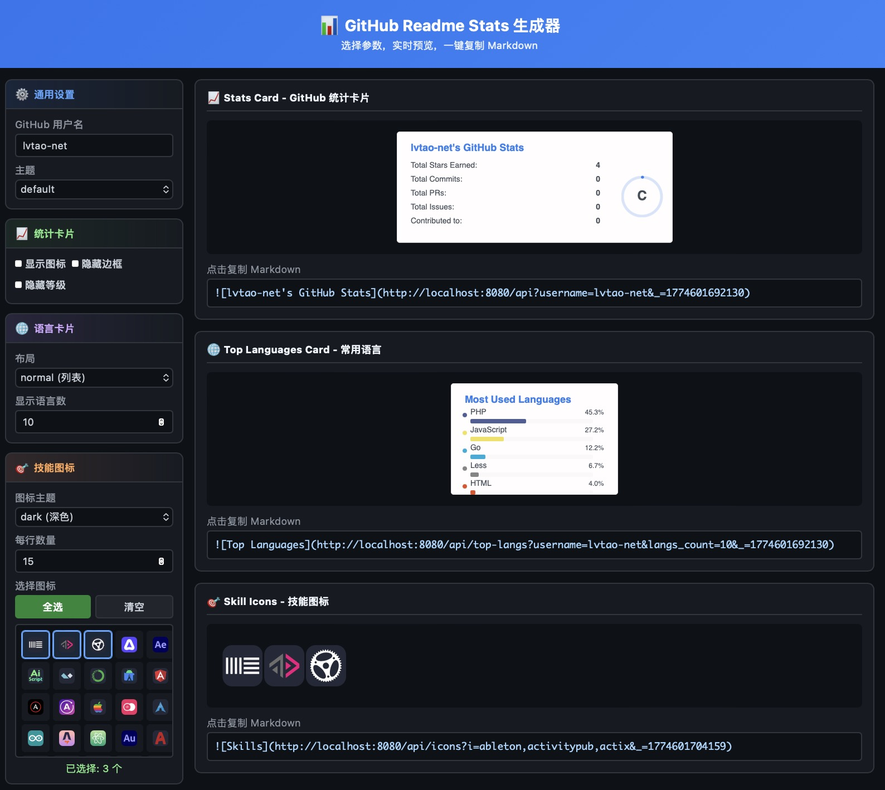

# GitHub Readme Stats (Go版本)

⚡ 动态生成GitHub统计数据卡片的Go语言实现



项目地址：https://github.com/lvtao-net/github-readme-stats-icons.git

这是一个用Go语言重写的 [github-readme-stats](https://github.com/anuraghazra/github-readme-stats) 项目，完整复刻了原项目的所有功能，并额外集成了 [skill-icons](https://github.com/tandpfun/skill-icons) 的图标功能。

## 功能特性

- **GitHub Stats Card** - 显示GitHub统计数据（Stars、Commits、PRs、Issues等）
- **Top Languages Card** - 显示最常用的编程语言
- **Repo Pin Card** - 置顶仓库卡片
- **Gist Pin Card** - 置顶Gist卡片  
- **WakaTime Stats Card** - 编程时间统计
- **Skill Icons** - 技能图标展示（239个图标，支持Dark/Light主题）
- **多主题支持** - 内置20+主题，支持自定义颜色
- **多种布局** - 支持normal、compact、donut、donut-vertical、pie等多种布局
- **缓存机制** - 内置缓存提高性能
- **完全兼容** - API接口与原项目保持一致

## 快速开始

### 1. 克隆项目

```bash
git clone https://github.com/lvtao-net/github-readme-stats-icons.git
cd github-readme-stats
```

### 2. 配置环境变量

```bash
cp .env.example .env
# 编辑 .env 文件，添加你的GitHub Token
```

### 3. 运行

```bash
# 开发模式
go run .

# 或编译运行
go build -o github-readme-stats .
./github-readme-stats
```

服务将在 http://localhost:8080 启动，访问 http://localhost:8080/ 查看示例页面。

## API接口

### 1. GitHub Stats Card

显示GitHub用户的统计数据。

```markdown

```

**参数说明：**

| 参数 | 类型 | 默认值 | 描述 |
|------|------|--------|------|
| username | string | - | GitHub用户名（必填） |
| hide | string | - | 隐藏指定统计项（逗号分隔） |
| show | string | - | 显示额外统计项（reviews,discussions_started等） |
| show_icons | boolean | false | 显示图标 |
| theme | string | default | 主题名称 |
| title_color | hex | - | 标题颜色 |
| text_color | hex | - | 文字颜色 |
| icon_color | hex | - | 图标颜色 |
| bg_color | hex | - | 背景颜色 |
| hide_border | boolean | false | 隐藏边框 |
| border_radius | number | 4.5 | 边框圆角 |
| hide_rank | boolean | false | 隐藏等级 |
| card_width | number | 495 | 卡片宽度 |
| custom_title | string | - | 自定义标题 |
| number_format | string | short | 数字格式（short/long） |
| include_all_commits | boolean | false | 统计所有提交 |

### 2. Top Languages Card

显示用户最常用的编程语言。

```markdown

```

**参数说明：**

| 参数 | 类型 | 默认值 | 描述 |
|------|------|--------|------|
| username | string | - | GitHub用户名（必填） |
| layout | string | normal | 布局（normal/compact/donut/donut-vertical/pie） |
| langs_count | number | 5 | 显示语言数量（1-20） |
| hide | string | - | 隐藏指定语言 |
| exclude_repo | string | - | 排除指定仓库 |
| hide_progress | boolean | false | 隐藏进度条 |
| size_weight | number | 1 | 代码量权重 |
| count_weight | number | 0 | 仓库数权重 |

### 3. Repo Pin Card

显示指定仓库的信息卡片。

```markdown

```

**参数说明：**

| 参数 | 类型 | 默认值 | 描述 |
|------|------|--------|------|
| username | string | - | 用户名（必填） |
| repo | string | - | 仓库名（必填） |
| show_owner | boolean | false | 显示仓库所有者 |

### 4. Gist Pin Card

显示指定Gist的信息卡片。

```markdown

```

**参数说明：**

| 参数 | 类型 | 默认值 | 描述 |
|------|------|--------|------|
| id | string | - | Gist ID（必填） |

### 5. Skill Icons

显示技能图标（239个图标，集成skill-icons功能）。

```markdown

```

**参数说明：**

| 参数 | 类型 | 默认值 | 描述 |
|------|------|--------|------|
| i | string | - | 图标列表（逗号分隔，必填） |
| theme | string | dark | 主题（dark/light） |
| perline | number | 15 | 每行图标数量（1-50） |

**使用 `i=all` 查看所有支持的图标。**

**支持的图标列表（186个）：**

| | | | | |
|:--|:--|:--|:--|:--|
| ableton | activitypub | actix | adonis | aftereffects |
| aiscript | alpinejs | anaconda | androidstudio | angular |
| ansible | apollo | apple | appwrite | arch |
| arduino | astro | atom | audition | autocad |
| aws | azul | azure | babel | bash |
| bevy | bitbucket | blender | bootstrap | bsd |
| bun | c | cassandra | clion | clojure |
| cloudflare | cmake | codepen | coffeescript | cpp |
| crystal | cs | css | cypress | d3 |
| dart | debian | deno | devto | discord |
| discordbots | discordjs | django | docker | dotnet |
| dynamodb | eclipse | elasticsearch | electron | elixir |
| elysia | emacs | ember | emotion | expressjs |
| fastapi | fediverse | figma | firebase | flask |
| flutter | forth | fortran | gamemakerstudio | gatsby |
| gcp | gherkin | git | github | githubactions |
| gitlab | gmail | godot | golang | gradle |
| grafana | graphql | gtk | gulp | haskell |
| haxe | haxeflixel | heroku | hibernate | html |
| htmx | idea | illustrator | instagram | ipfs |
| java | javascript | jenkins | jest | jquery |
| julia | kafka | kali | kotlin | ktor |
| kubernetes | laravel | latex | less | linkedin |
| linux | lit | lua | markdown | mastodon |
| materialui | matlab | maven | mint | misskey |
| mongodb | mysql | neovim | nestjs | netlify |
| nextjs | nginx | nim | nix | nodejs |
| notion | npm | nuxtjs | obsidian | ocaml |
| octave | opencv | openshift | openstack | p5js |
| perl | photoshop | php | phpstorm | pinia |
| pkl | plan9 | planetscale | pnpm | postgresql |
| postman | powershell | premiere | prisma | processing |
| prometheus | pug | pycharm | python | pytorch |
| qt | r | rabbitmq | rails | raspberrypi |
| react | reactivex | redhat | redis | redux |
| regex | remix | replit | rider | robloxstudio |
| rocket | rollupjs | ros | ruby | rust |
| sass | scala | scikitlearn | selenium | sentry |
| sequelize | sketchup | solidity | solidjs | spotify |
| spring | sqlite | stackoverflow | styledcomponents | sublime |
| supabase | svelte | svg | swift | symfony |
| tailwindcss | tauri | tensorflow | terraform | threejs |
| twitter | typescript | ubuntu | unity | unrealengine |
| v | vala | vercel | verilog | vim |
| visualstudio | vite | vitest | vscode | vscodium |
| vuejs | vuetify | webassembly | webflow | webpack |
| webstorm | windicss | windows | wordpress | workers |
| xd | yarn | yew | zig | |

**图标别名（短名称）：**

| 别名 | 全称 |
|------|------|
| js | javascript |
| ts | typescript |
| py | python |
| go | golang |
| vue | vuejs |
| react | react |
| node | nodejs |
| ps | photoshop |
| ai | illustrator |
| pr | premiere |
| ae | aftereffects |
| md | markdown |
| scss | sass |
| tailwind | tailwindcss |
| mui | materialui |
| postgres | postgresql |
| mongo | mongodb |
| k8s | kubernetes |
| next | nextjs |
| nuxt | nuxtjs |
| nest | nestjs |
| cf | cloudflare |
| aws | aws |
| gcp | gcp |
| bots | discordbots |
| express | expressjs |
| net | dotnet |
| windi | windicss |
| unreal | unrealengine |
| ktorio | ktor |
| pwsh | powershell |
| au | audition |
| rollup | rollupjs |
| rxjs/rxjava | reactivex |
| ghactions | githubactions |
| sklearn | scikitlearn |

**API端点：**

- `GET /api/icons/list` - 获取所有图标名称列表
- `GET /api/icons/meta` - 获取图标元数据（包含主题支持信息）
- `GET /api/icons?i=all` - 显示所有图标

**使用 `i=all` 显示所有图标：**

```markdown

```

## 主题列表

内置主题：

- `default` - 默认主题
- `dark` - 深色主题
- `radical` - 激进主题
- `merko` - 墨绿主题
- `gruvbox` - Gruvbox主题
- `tokyonight` - 东京夜景
- `onedark` - One Dark
- `cobalt` - 钴蓝主题
- `synthwave` - 合成波
- `highcontrast` - 高对比度
- `dracula` - 德古拉
- `prussian` - 普鲁士蓝
- `monokai` - Monokai
- `vue` - Vue风格
- `vue-dark` - Vue深色
- `github-dark` - GitHub深色
- `github-dark-blue` - GitHub深蓝
- `transparent` - 透明背景

**使用主题：**

```markdown

```

**自定义颜色：**

```markdown

```

## 使用示例

### 基础用法

```markdown

```

### 隐藏指定统计

```markdown

```

### 显示额外统计

```markdown

```

### 紧凑布局语言卡片

```markdown

```

### 环形图语言卡片

```markdown

```

### 技能图标

```markdown

```

### 并排显示

```markdown
<a href="https://github.com/lvtao-net">
  
</a>
<a href="https://github.com/lvtao-net">
  
</a>
```

## 环境变量配置

| 变量 | 默认值 | 描述 |
|------|--------|------|
| PAT_1 | - | GitHub Personal Access Token |
| CACHE_SECONDS | 21600 | 缓存时间（秒） |
| PORT | 8080 | 服务端口 |
| WHITELIST | - | 允许的用户名白名单 |
| GIST_WHITELIST | - | 允许的Gist ID白名单 |
| EXCLUDE_REPO | - | 默认排除的仓库 |
| FETCH_MULTI_PAGE_STARS | false | 获取所有star仓库 |

## GitHub Token

为了获得更高的API请求配额和访问私有数据，建议配置GitHub Token：

1. 访问 https://github.com/settings/tokens
2. 生成新的Personal Access Token
3. 选择权限：`read:user` 和 `repo`
4. 将Token设置为环境变量 `PAT_1`

## 项目结构

```
github-readme-stats/
├── main.go                      # 入口文件
├── go.mod                       # Go模块
├── go.sum                       # Go依赖校验
├── .env.example                 # 环境变量示例
├── .gitignore                   # Git忽略配置
├── README.md                    # 项目文档
├── Makefile                     # 构建脚本
├── internal/
│   ├── api/
│   │   └── handlers.go          # API处理器
│   ├── cards/
│   │   └── render.go            # 卡片渲染
│   ├── github/
│   │   └── client.go            # GitHub API客户端
│   ├── cache/
│   │   └── cache.go             # 缓存管理
│   ├── config/
│   │   └── config.go            # 配置管理
│   ├── icons/
│   │   └── icons.go             # 图标管理
│   ├── themes/
│   │   └── themes.go            # 主题定义
│   └── utils/
│       └── utils.go             # 工具函数
└── assets/
    └── icons/                   # 技能图标SVG文件
```

## 技术栈

- **Go 1.21+** - 后端语言
- **Gin** - Web框架
- **GitHub API** - 数据获取
- **SVG** - 卡片渲染

## 与原项目的区别

1. **性能** - Go语言实现，更高的并发处理能力
2. **部署** - 单二进制文件，部署更简单
3. **集成** - 内置skill-icons功能（239个图标）
4. **API兼容** - 完全兼容原项目的API接口

## 贡献

欢迎提交Issue和PR！

项目地址：https://github.com/lvtao-net/github-readme-stats-icons.git

## 许可证

MIT License

## 致谢

- 原项目 [anuraghazra/github-readme-stats](https://github.com/anuraghazra/github-readme-stats)
- 图标项目 [tandpfun/skill-icons](https://github.com/tandpfun/skill-icons)
